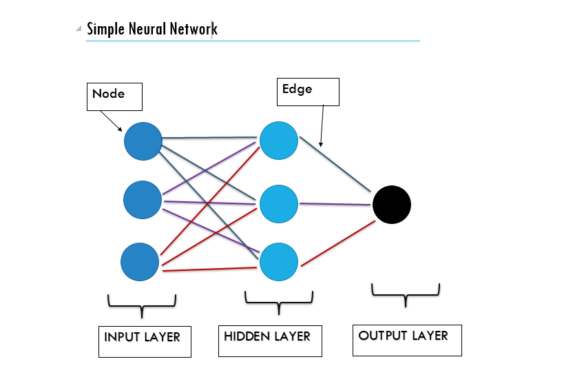
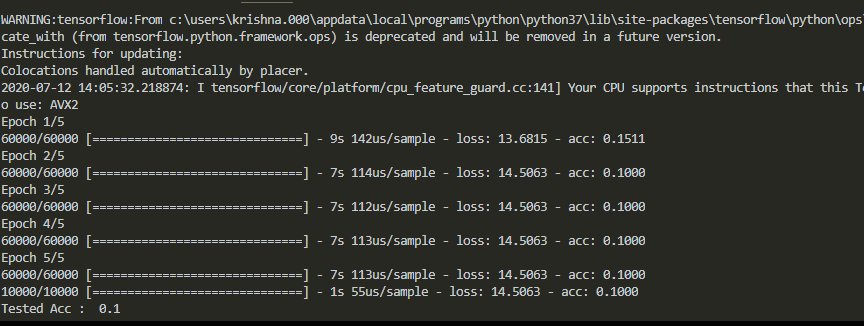
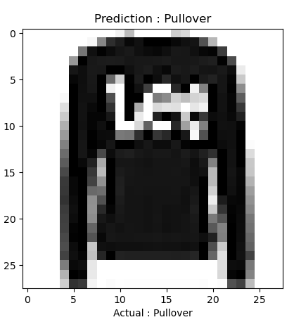
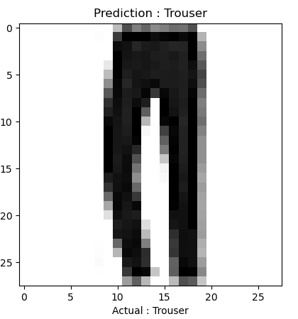

DEEP LEARNING
---
>pip install requirements.txt **Important** 

## Python Intro to Neural Network

1. What is Neural Network
2. Loading and Looking at Data
3. Creating a model in tensorflow
4. Using the model to make Prediction
5. Text Classification (example)

## 1. What is Neural Network

Neural network is model that is used to recognise complex pattern in data. It is inspired by the biological neural network that constitutes human. It consist of multiple layers and every layer have two main attributes :- Nodes (as Neurons) and Edges (as the connection between the nodes).


*Neural_Network*

**Some Examples :-**

#### Neural Network used for labelled data(Supervised Learning) :-
`Text Processing (RNTN)` `Image Recognition (CNN, DBN)` `Object Recognition (RNTN, CNN)` `Speech Recognition (RNN)`

#### Neural Network used for Unlabelled data(Unsupervised Learning) :-
`Feature Extraction (RBM)` `Pattern Recognition (Autoencoders)` 

## 2. Loading and Looking at data 

>Python code :-

```Python
# Prediction of clothes through images (shirt, shoes etc).

# Importing Libraries

import tensorflow as tf
from tensorflow import keras
import numpy as np
import matplotlib.pyplot as plt

# Loading data(fashion includes different clothes) from keras

data = keras.datasets.fashion_mnist

# Splitting the images and labels into train and test data.

(train_images, train_labels), (test_images, test_labels) = data.load_data()
print(train_labels[6])

# As value of array of train_imagess between pixel value ranging from 1-255

train_images = train_images/255.0
test_images = test_images/255.0

# Adding labels in list so that it can be easilyi identified later

class_names = ['T-shirt/top','Trouser','Pullover','Dress','Coat','Sandal','Shirt','Sneaker','Bag','Ankle-Boot']

# Showing the image using matplot

plt.imshow(train_images[7], cmap = plt.cm.binary)
plt.show()
```
## 3. Creating a model in tensorflow


*Screenshot of training of model.*

>Python code :-

```Python
# Creating a model

model = keras.Sequential([
    keras.layers.Flatten(input_shape = (28,28)), # Input Layer
    keras.layers.Dense(128, activation= 'relu'), # Hidden Layer
    keras.layers.Dense(10, activation='softmax') # Output Layer
])

model.compile(optimizer='adam', loss ='sparse_categorical_crossentropy', metrics = ['accuracy'])

# Training of Model

model.fit(train_images, train_labels, epochs=5)


# Evaluation of model(testing of data)

test_loss, test_acc = model.evaluate(test_images, test_labels)
print("Tested Acc : ", test_acc)
```
## 4. Using the model for prediction

 

*Screenshots of outputs*

>Python code :-

```Python
# Using model to predict

#model.save('fashion_mnist.h5')
#load_model('fashion_mnist.h5')
prediction = model.predict([test_images]) # takes np.array()
print(np.argmax(prediction[0]))           # print the largest value and get the index of that value of image -> 0
print('Output : ',class_names[np.argmax(prediction[0])]) # Print the class name of the given result

# To present prediction for 5 inputs using matplot

for i in range(5):
    plt.grid(False)
    plt.imshow(test_images[i], cmap = plt.cm.binary)
    plt.xlabel("Actual : "+class_names[test_labels[i]])
    plt.title("Prediction : "+class_names[np.argmax(prediction[i])])
    plt.show()
```

## Artificial Neural Network

_Python example_<br>


`Run ann.py`
