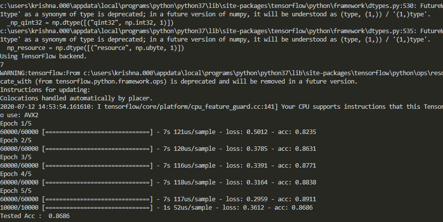

DEEP LEARNING
---
>pip install requirements.txt **Important** 

## Python Intro to Neural Network

1. What is Neural Network
2. Loading and Looking at Data
3. Creating a model in tensorflow
4. Using the model to make Prediction
5. Text Classification (example)

## 1. What is Neural Network

Neural network is model that is used to recognise complex pattern in data. It is inspired by the biological neural network that constitutes human. It consist of multiple layers and every layer have two main attributes :- Nodes (as Neurons) and Edges (as the connection between the nodes).

*Fig:1 Neural_Network*

**Some Examples :-**

#### Neural Network used for labelled data(Supervised Learning) :-
`Text Processing (RNTN)` `Image Recognition (CNN, DBN)` `Object Recognition (RNTN, CNN)` `Speech Recognition (RNN)`

#### Neural Network used for Unlabelled data(Unsupervised Learning) :-
`Feature Extraction (RBM)` `Pattern Recognition (Autoencoders)` 

## 2. Loading and Looking at data 

>Python code :-

```Python
# Prediction of clothes through images (shirt, shoes etc).

# Importing Libraries

import tensorflow as tf
from tensorflow import keras
import numpy as np
import matplotlib.pyplot as plt

# Loading data(fashion includes different clothes) from keras

data = keras.datasets.fashion_mnist

# Splitting the images and labels into train and test data.

(train_images, train_labels), (test_images, test_labels) = data.load_data()
print(train_labels[6])

# As value of array of train_imagess between pixel value ranging from 1-255

train_images = train_images/255.0
test_images = test_images/255.0

# Adding labels in list so that it can be easilyi identified later

class_names = ['T-shirt/top','Trouser','Pullover','Dress','Coat','Sandal','Shirt','Sneaker','Bag','Ankle-Boot']

# Showing the image using matplot

plt.imshow(train_images[7], cmap = plt.cm.binary)
plt.show()
```
## 3. Creating a model in tensorflow

*Fig:2 Screenshot of training of model.*

>Python code :-

```Python
# Creating a model

model = keras.Sequential([
    keras.layers.Flatten(input_shape = (28,28)), # Input Layer
    keras.layers.Dense(128, activation= 'relu'), # Hidden Layer
    keras.layers.Dense(10, activation='softmax') # Output Layer
])

model.compile(optimizer='adam', loss ='sparse_categorical_crossentropy', metrics = ['accuracy'])

# Training of Model

model.fit(train_images, train_labels, epochs=5)


# Evaluation of model(testing of data)

test_loss, test_acc = model.evaluate(test_images, test_labels)
print("Tested Acc : ", test_acc)
```
## 4. Using the model for prediction

 *Fig:3 Screenshots of outputs*

>Python code :-

```Python
# Using model to predict

#model.save('fashion_mnist.h5')
#load_model('fashion_mnist.h5')
prediction = model.predict([test_images]) # takes np.array()
print(np.argmax(prediction[0]))           # print the largest value and get the index of that value of image -> 0
print('Output : ',class_names[np.argmax(prediction[0])]) # Print the class name of the given result

# To present prediction for 5 inputs using matplot

for i in range(5):
    plt.grid(False)
    plt.imshow(test_images[i], cmap = plt.cm.binary)
    plt.xlabel("Actual : "+class_names[test_labels[i]])
    plt.title("Prediction : "+class_names[np.argmax(prediction[i])])
    plt.show()
```

## 5. Text Classification Using Deep Learning

*Screenshots*<br>

*Fig:4 Model Training* *Fig:5 Example on test_data* *Fig:6 Example of movie joker review*

>Python Code :-
```Python
# Importing libraries

import tensorflow as tf
from tensorflow import keras
import numpy as np
from keras.models import load_model

# Loading dataset

data = keras.datasets.imdb

(train_data, train_labels), (test_data, test_labels) = data.load_data(num_words = 88000 ) # Split 88000 words

# Getting word_index

word_index = data.get_word_index()

word_index = {k:(v+3) for k,v in word_index.items()}


word_index['<PAD>'] = 0 # Creating Padding Word Tag, all comments have different length so we give padding tag so that each and every comment have same length
word_index['<START>'] = 1 # Creating Start Word Tag
word_index['<UNK>'] = 2 # Creating unknown Word Tag
word_index['<UNUSED>'] = 3 # Creating unused Word Tag


reverse_word_index = dict([(value, key) for (key, value) in word_index.items()]) #Giving integer pointing towards words

# Preprocessing of data

# Allowing 250 words in comments

train_data = keras.preprocessing.sequence.pad_sequences(train_data, value = word_index['<PAD>'], padding ='post', maxlen = 250)
test_data = keras.preprocessing.sequence.pad_sequences(test_data, value = word_index['<PAD>'], padding ='post', maxlen = 250)

# Function For making prediction readable return text comment
def decode_review(text):
    return " ".join([reverse_word_index.get(i, "?") for i in text])

print(decode_review(test_data[0]))

# Model

model = keras.Sequential()
model.add(keras.layers.Embedding(88000 ,16)) # This layer is responsible for finding vectors of each word
model.add(keras.layers.GlobalAveragePooling1D()) # Convert into average for each layer
model.add(keras.layers.Dense(16, activation = 'relu')) # To recognize pattern
model.add(keras.layers.Dense(1, activation = 'sigmoid'))

model.summary()
model.compile(optimizer='adam', loss='binary_crossentropy', metrics=['accuracy'])

# Saving Model

 model.save('imdb_model.h5')


# Splitting the training data into validation and training data

 x_val = train_data[:10000]
 x_train = train_data[10000:]

 y_val = train_labels[:10000]
 y_train = train_labels[10000:]

 # Model Fitting

 fitModel = model.fit(x_train, y_train, epochs=40, batch_size=512, validation_data = (x_val, y_val), verbose=1)


# Evaluation of test_data

results = model.evaluate(test_data, test_labels)
print(results)
```

*Saving and Loading model*

```Python
# Saving Model

model.save('imdb_model.h5')

# Loading Model

model = keras.models.load_model('imdb_model.h5')

```
_After Saving Model we don't need to compile model again . This will reduce time and cost for training data_

*Example of predicting review (Range from 0: Bad to 1: Good)* 

```Python
# Example of Prediction of data from test data

test_review = test_data[0]
predict = model.predict([test_review])
print('Review : ')
print(decode_review(test_review))
print('Prediction : ',str(predict[0]))
print('Actual : ',str(test_labels[0]))

# Example of Prediction of data from online data

print('-'*35,'Example For prediction of Movie Review','-'*35)

# Loading text file

# Review_encode Function

def review_encode(s):
    encoded = [1]

    for word in s:
        if word in word_index:
            encoded.append(word_index[word.lower()])
        else:
            encoded.append(2)
    return encoded

with open('test.txt',encoding = 'utf-8') as f:
    for line in f.readlines():
        nline = line.replace(',',"").replace('.',"").replace('(',"").replace(')',"").replace(':',"").replace("\"","").strip()
        encode = review_encode(nline)
        encode = keras.preprocessing.sequence.pad_sequences([encode], value = word_index['<PAD>'], padding ='post', maxlen = 250)
        predict = model.predict(encode)
        print(line)
        print(encode)
        print(predict[0]) 
```
## Artificial Neural Network

_Python example_<br>


`Run ann.py`
